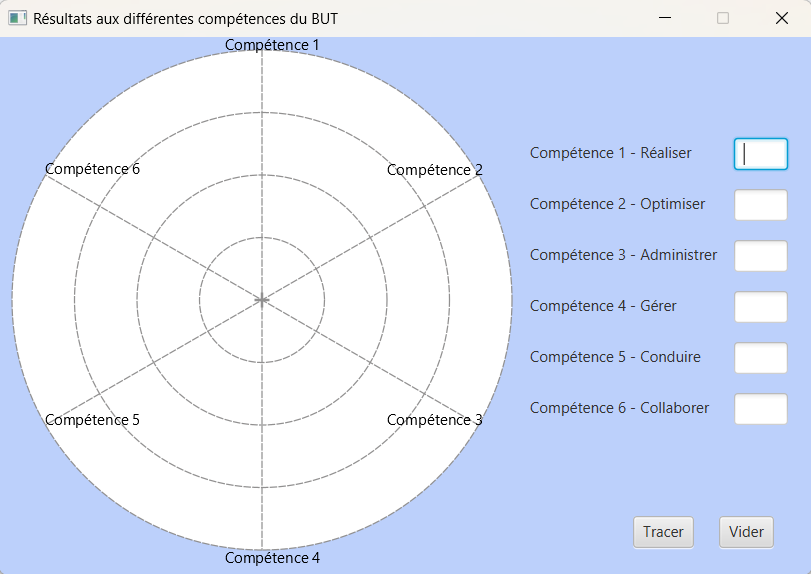
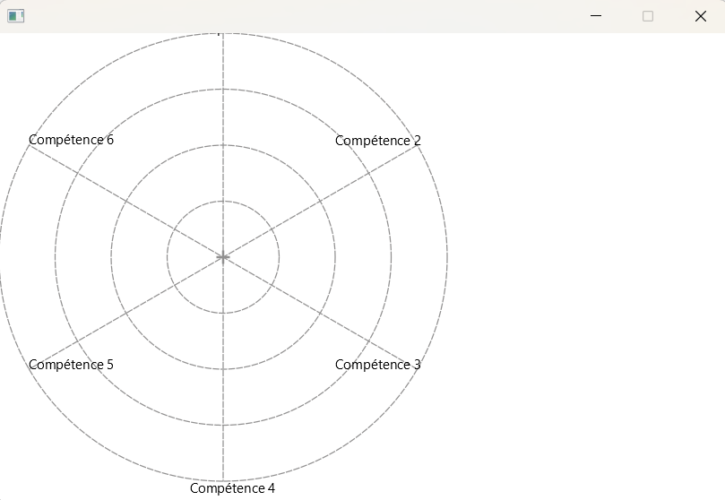
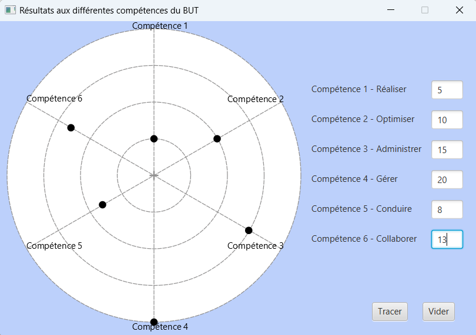
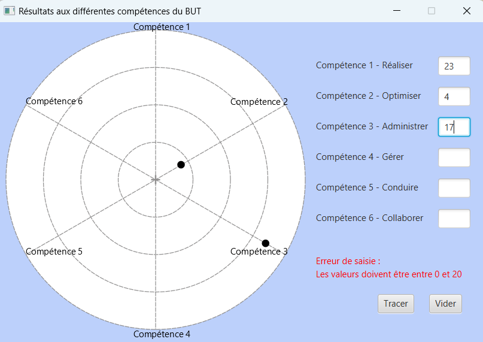

# CC3 - Réalisation d'une petite application en JavaFX  (note sur 20 coeff. 13)

**Évaluation individuelle sur machine en salle TP, et temps limité (4h).**  

Les documents sont autorisés, tout comme les recherches sur le Web. Par contre, toute communication entre étudiants (quelle que soit la forme) est interdite, tout comme l’utilisation d‘outils de type ChatGPT. 

Cette évaluation contribue aux compétences :

  - Compétence 1 – "développer", AC11.02 "élaborer des conceptions simples et AC11.04 "développer des interfaces utilisateurs" -> coeff. 10
  - Compétence 5 - "Conduire", AC15.06 "appréhender les besoins du client et de l'utilisateur: analyse et retranscription des besoins -> coeff. 3

L'objectif dans cette évaluation est de développer une application permettant de visualiser un ensemble de notes sous la forme d'un [diagramme en radar](https://www.lelivrescolaire.fr/page/7402608). Elle permettra à l'utilisateur de saisir ou mettre à jours des notes, et afficher le diagramme associé. Son interface graphique devra reproduire le modèle suivant. Les cercles s'afficheront progressivement à la saisie des valeurs, et les lignes seront ajoutées à la validation de l'ensemble des données.

## Partie 1 - Reproduire l'interface graphique

Au départ, le code mis à disposition via [GitHub Classroom]() affiche l'interface suivante :

Vous allez donc  modifier le code afin de reproduire l'interface du modèle ci-dessus (première capture d'écran). Pour cela, vous vous appuierez sur le fichier FXML disponible. 

## Partie 2 - Dessiner des points après ajout des notes

Dans cette partie, vous allez faire en sorte d'ajouter un point dans le graphique après chaque ajout de note.

Dans ce type de graphique, le centre du diagramme radar représente la valeur 0. Le cercle le plus extérieur du radar représente la note 20. Chaque rayon (ligne partant du centre) représente une compétence. Par exemple, le premier rayon vertical en haut représente la compétence 1. Le rayon suivant dans le sens des aiguilles d'une montre représente la compétence 2. Le suivant représente la compétence 3, etc. La note obtenue à une compétence est affichée sous la forme d'un point sur le rayon correspondant.

Après une action dans le champs de saisi, vous devrez donc récupérer la note saisie, identifier la compétence associée au champs de saisie et dessiner le point (un cercle JavaFX) sur l'axe correspondant dans le diagramme radar. 

Pour facilement retrouver la compétence associée à un champs de saisie, vous pouvez nommer vos champs de saisie en fonction de la compétence associée. Par exemple, le champs de saisie associé à la compétence 1  aura l'identifiant "comp1".  Le champs de saisie associé à la  compétence 2 aura l'identifiant "comp2", etc.

Pour dessiner le point correspondant à la note dans le diagramme, vous avez deux méthodes mises à disposition dans le code. Il s'agit de `getXRadarChart(double value, int axe)` et `getYRadarChart(double value, int axe)`. Elles permettent de facilement calculer les coordonnée (x,y) du cercle JavaFX associée à la note `value` et la compétence `axe`.

A la fin de cette étape, vous obtenez le rendu suivant :

## Partie 3 - Réinitialiser le diagramme radar et vérifier les notes

Vous allez intégrer dans cette partie deux nouvelles fonctionnalités.  La première consiste à  vérifier après chaque saisie (et avant affichage dans le diagramme) que les notes sont bien entre 0 et 20. En cas d'erreur de saisie dans un des champs, vous devrez afficher en rouge un message d'erreur au dessus des boutons.

La deuxième fonctionnalité consiste à effacer les valeurs saisies et les points dessinés (et les potentiels messages d'erreur) après un clic sur le bouton `Vider`.

## Partie 4 - Dessiner des lignes entre les points

Il faut maintenant tracer des lignes entre les points représentant les notes afin de réellement avoir un diagramme radar. Le dessin des lignes sera effectué après un clic sur le bouton `Tracer`. Pour faire cela, vous pouvez construire un tableau des points créés pour chaque compétence, puis parcourir ce tableau pour tracer les lignes entre les points consécutifs. 

Mettre ensuite à jours le comportement du bouton `Vider` pour qu'il efface aussi les lignes tracées. 

## Partie 5 - Gérer les mises à jours des notes

Les notes dans les champs de saisie peuvent être modifiées. Dans ce cas, le diagramme radar doit donc être actualisé.  Si ce n'est pas déjà fait, vous devez intégrer cela dans votre code.

 Plusieurs approches sont possibles pour synchroniser les valeurs saisies, les points et lignes dessinés. Vous ferez donc attention à utiliser la technique la plus adaptée pour implémenter cette fonctionnalité.

